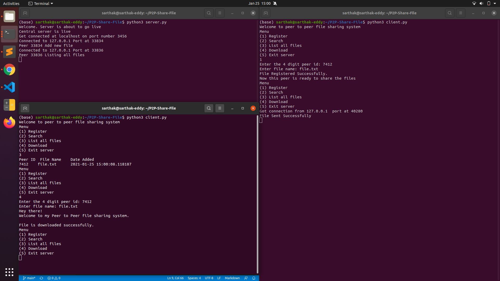

# P2P-Share-File
A Napster style peer to peer file sharing system.

# Features
  <li>Uses multithreading to connect multiple clients to server.</li> 
  <li>Uses socket connection to have peer to peer connection.</li>
  <li>Each peer has options like register (to register a new file and make it available for other peers),
  search (to search for files available), list all files (to list all files available at all peers), 
download (to download a particular file from given port at which it is available.</li>

# Installation

### Running locally
Follow given steps  
    1. Clone or Download the repository.
        <pre>git clone https://github.com/sarthakeddy/P2P-Share-File.git
        cd P2P-Share-File</pre>
    2. Start the server
    	<pre>python3 server.py</pre>
    3. Connect client in other terminal
    	<pre>python3 client.py</pre>
    4. Server runs at port 3456. Change port if port is busy in server.py and client.py file.

## Screenshots

## Get in touch

